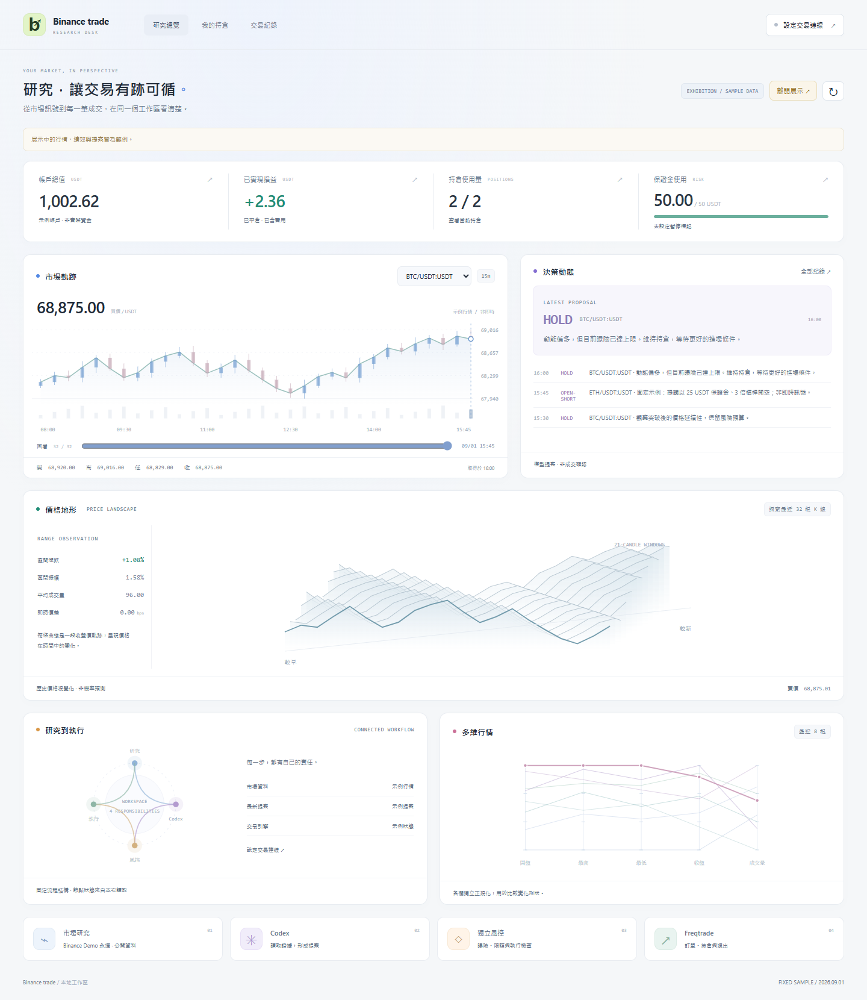
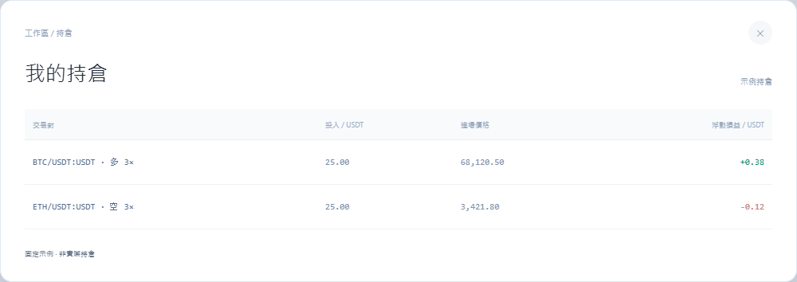
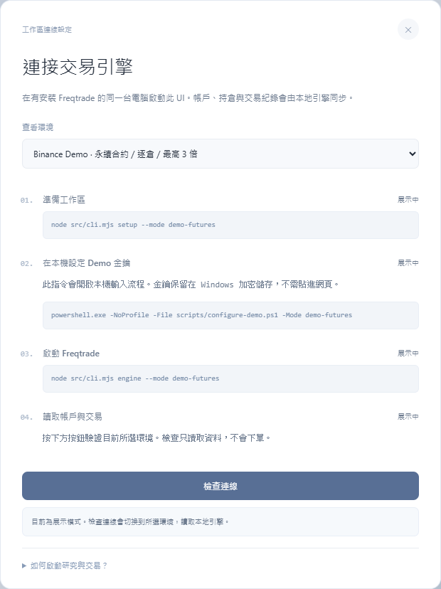

# Binance trade

獨立的 Windows 原生 Binance 現貨與 USDT 永續合約研究、模擬交易專案。
Demo 目前以固定突破規則產生決策；dry-run 保留 Codex CLI 分析。程式風控決定能否送單；Freqtrade 管理訂單、持倉與退出。
不使用 Docker，不連接 OpenAlice／UTA，不支援真實資金交易。

## 目前的 Demo 策略

`config/decision.json` 已選用 Demo 實驗版 `buffered-breakout-atr-v3`。單根 5 分鐘已收盤 K 線突破／跌破前 20 根高低點，另需超過 0.1 ATR 緩衝；配合 1h／4h 方向、均線、量能與成本檢查。現貨買入／賣出持有資產，合約可做多或做空，目前限 1 倍逐倉。每個方向的排除原因與門檻分別存於 `rules.json` 的 `directionChecks`。

Demo 每 5 分鐘收盤後約 5 秒啟動一輪，每輪取 96 根已收盤 K 線。1／4 小時方向分別以 12／48 根位移計算；訊號最長有效 120 秒，下一根收盤即失效。本機 dry-run 與無週期標記的舊歷史檔維持 15m。

每筆新版進場會保存數值退出計畫：依成交價套用 1 ATR 比例停損（上限 2%）、2 ATR 目標、最長 4 小時。既有 ROI 與現貨追蹤停利仍可能較早退出。引擎必須回報 `demo-rule-exits-v3` 且 timeframe 為 `5m` 才可新增規則倉位，舊 v1／v2 持倉仍沿用其既有數值退出計畫。策略尚未證明獲利，僅供 Demo 測試。

另有獨立的 `ai-high-frequency-shadow-v1` 影子觀測器：每分鐘讀取公開訂單簿、主動成交與已收盤 1 分鐘 K 線，每 5 個週期才更新一次受限 AI 策略設定，並在 60 秒後記錄扣除研究成本情境的 markout。它固定是 `dry-run`、`tradeEnabled:false`，不會改變 Demo 下單規則或送出訂單。執行 `npm run ai:high-frequency-shadow -- --cycles 10 --interval-seconds 60` 可做有限週期觀測；完整限制與輸出見 [影子層紀錄](docs/ai-high-frequency-shadow-2026-09-18.md)。

實際的高頻交易路徑是 Demo 的 `src/cli.mjs watch`（`live-flow-adaptive-v2`），現貨與合約各自運行，每 60 秒重新評估新鮮訂單流並交給既有成本、帳戶、原生停損與送單防護。現貨只允許做多，合約允許做多與做空；影子層不能取代這條送單路徑，也不能另外啟動第二個同帳戶 watcher，避免重複開倉。

費率由 Demo 簽名唯讀接口讀取；缺漏或過期禁止新進場。滑點為設定假設。`watch` 每分鐘記錄全帳戶估值，未對帳外部資金流，因此估值變化不能當作策略淨利。

執行 `npm run baseline -- download --mode demo --pair BTC/USDT --days 30` 可產生獨立歷史基準。資料、成本、原始碼及結果保存於 `local/<mode>/baselines/`；它不是完整引擎退出重播，也不是已驗證的樣本外績效。合約基準目前僅接受資金費率事件精確對齊 K 線邊界的資料，遇到不支援的時間戳會停止，不會假設費用為零。

切換紀錄與驗證結果見 [v1 啟用紀錄](docs/rules-demo-activation-2026-09-10.md) 、[v2 進場修改](docs/entry-v2-2026-09-10.md) 與 [5 分鐘 v3 啟用](docs/five-minute-2026-09-10.md)。

## 介面預覽

以下為程式實際介面的 **Demo 展示模式截圖**，使用固定範例資料；畫面中的餘額、損益與提案不代表實際帳戶或策略績效。

### 研究總覽

在同一頁查看行情、Codex 提案、保證金使用情況與研究到執行的流程。



### 合約持倉

顯示每筆部位的多空方向、槓桿、保證金與浮動損益。圖中的兩筆 25 USDT 為固定示例；目前單筆保證金上限為 **50 USDT**，最高 **3 倍槓桿**。



### Demo 連線設定

選擇現貨或永續合約環境，依序完成本機設定、Demo 金鑰輸入與引擎啟動。畫面不接收金鑰；「檢查連線」只讀取狀態，不會下單。圖中為展示流程，並非帳戶已連線的證明。



## 三種模式

| | 本機模擬（預設） | Demo 現貨 | Demo USDT 永續合約 |
|---|---|---|---|
| 模式參數 | 不加參數 | `--mode demo` | `--mode demo-futures` |
| 成交位置 | Freqtrade 本機模擬 | 幣安 Demo 虛擬帳戶 | 幣安 Futures Demo 虛擬帳戶 |
| 方向／槓桿 | 現貨多單／1 倍 | 現貨多單／1 倍 | 多空／逐倉／1–3 倍 |
| 金鑰 | 不需要 | 現貨 Demo 專用 | 合約 Demo 專用 |
| 本機 API | 127.0.0.1:18080 | 127.0.0.1:18082 | 127.0.0.1:18084 |
| 資料目錄 | local/ | local/demo/ | local/demo-futures/ |

每個模式的認證、資料庫、訂單紀錄、停止標記和報表都分開。
本機模擬與 Demo 都不是策略獲利證明。Demo 也不是 Spot Testnet。

## 本機模擬快速開始

這台電腦的依賴已安裝。在第一個 PowerShell：

~~~powershell
Set-Location -LiteralPath 'D:\Codex\Binance trade'
node src/cli.mjs doctor
node src/cli.mjs engine
~~~

保持引擎終端開啟，在另一個 PowerShell：

~~~powershell
Set-Location -LiteralPath 'D:\Codex\Binance trade'
node src/cli.mjs cycle
node src/cli.mjs report
~~~

cycle 執行一輪研究、Codex 分析與風控；HOLD／觀望是正常結果。
Codex 使用本機既有登入。若需要登入，請在自己的終端執行 codex login。

## 接幣安 Demo 現貨

1. 在幣安 Demo Trading 的 API 管理建立 **Demo 專用** Key／Secret。
2. 執行以下指令，在本機提示中輸入金鑰；不要貼到聊天。
3. 先跑唯讀帳戶檢查，確認連線與權限，再啟動 Demo 引擎。

~~~powershell
Set-Location -LiteralPath 'D:\Codex\Binance trade'
node src/cli.mjs setup --mode demo
powershell.exe -NoProfile -File scripts/configure-demo.ps1
node src/cli.mjs demo-check --mode demo
node src/cli.mjs engine --mode demo
~~~

另一個終端：

~~~powershell
Set-Location -LiteralPath 'D:\Codex\Binance trade'
node src/cli.mjs cycle --mode demo
node src/cli.mjs health --mode demo
node src/cli.mjs report --mode demo
~~~

金鑰以 Windows DPAPI 加密，只有相同 Windows 使用者可以正常解密；
換電腦要重新輸入。研究用 Codex 不會收到這些金鑰。
使用獨立供本專案使用的 Demo 帳戶／環境；同帳戶的不同 Key 不會隔離資金。
不要同時在該帳戶手動交易或交給另一個機器人管理。

**實作方式：** Freqtrade 2026.8 原本停用 Binance Demo。本專案使用程序內的
Demo 適配層，保留 Freqtrade 的訂單與退出管理，未修改安裝套件。
同步與非同步交易連線都限制到 https://demo-api.binance.com/api/，拒絕轉址，
關閉不適用的 WebSocket、期貨與錢包服務。詳見 [運作契約](docs/operations.md)。

Freqtrade 內部用 `dry_run: false`／`runmode: live` 表示要送到交易所；
本專案的 Demo 還必須有 `demo_trading: true`、專用引擎身份和 Demo 網址保護。
不能只手動更改 dry_run 來切換模式。

## Demo 帳戶買賣驗收

填好 Demo 金鑰、完成唯讀檢查並啟動 Demo 引擎後，可明確執行：

~~~powershell
npm.cmd run test:demo-account
~~~

此命令會使用虛擬資金做一筆 BTC/USDT 買入與賣出。開始前要求沒有掛單、
沒有本引擎持倉，且不處於停止狀態；保留原有風控上限。最後核對引擎持倉、
交易所掛單和 BTC 餘額差額，結果存入 local/demo/acceptance/。

失敗不會盲目重試或清掉原有帳戶資產。先看 status／reconcile 與驗收紀錄；
引擎會保持運行以管理已存在的持倉。尚未提供 Demo 金鑰時，
簽名 API、Demo 成交與費用核對仍屬待驗收項目。

## 持續運行、監控、停止

~~~powershell
node src/cli.mjs watch --mode demo
node src/cli.mjs health --mode demo
node src/cli.mjs stop --mode demo
~~~

watch 在前景每輪完成後等待 900 秒；持續寫入心跳和執行結果。
同一模式只允許一個 watch、一輪 cycle 和一個引擎啟動器。
連續三輪失敗會寫入 STOP 並停止新開倉。錯誤代碼、最後成功時間與階段
可用 health 查看。沒有建立開機啟動、Windows 服務或背景排程。

stop 是「暫停新開倉」，不是全部平倉。既有止損與 ROI 退出需要
Freqtrade、網路與電腦保持運作。按 Ctrl+C 可停止研究迴圈；
引擎本身請先檢查持倉後再停止。已送出的請求不能靠 STOP 撤回。

修復問題後：

~~~powershell
node src/cli.mjs reconcile --mode demo
node src/cli.mjs resume --mode demo
node src/cli.mjs watch --mode demo
~~~

resume 要求引擎身份正確且沒有未知送單；不會自行啟動研究。

## 異常中斷與鎖檔復原

~~~powershell
node src/cli.mjs health --mode demo
node src/cli.mjs recover-lock cycle --mode demo
~~~

可指定 engine、watch、cycle、execution、health 或 events。
只有確認記錄的程序及子程序已結束，且沒有其他可辨識的專案程序時才移除。
無法確認、PID 被重用或另有專案程序時會拒絕；不會按時間強搶鎖。
Windows 程序查詢權限不足時也會停止恢復。

recover-lock 不修改訂單紀錄，也不代表某筆訂單未送出。
未知訂單必须透過 reconcile 取得明確證據；找不到時繼續阻擋送單。

## 研究資料

config/research.json 管理每個商品的鏈上代幣映射與公開觀察錢包。
目前 BTC/USDT、ETH/USDT 的自動研究包含：

- 已收盤 15 分鐘 K 線、SMA8／20、1 小時／4 小時報酬、ATR14、相對成交量。
- Binance Web3 排名背景及代幣搜尋候選；候選明確標成未驗證。
- 當有明確合約映射時，加入代幣基本資訊、動態資料與安全查詢。
- 當有設定觀察錢包時，加入公開持倉查詢，標示只有第一頁。

BTC／ETH 未設定合約映射；不把同名包裝代幣自動當成原生幣。
每個映射必須包含 chainId、contractAddress、relationship、source、note；
relationship 可為 token 或 wrapped-proxy。钱包需 chainId、address、label。
缺少映射或查詢失敗會明確記錄，安全查詢無結果不等於低風險。

四個固定版本技能仍可個別呼叫，使用 `node src/cli.mjs help` 查看介面。
部分上游 K 線查詢使用 dquery.sintral.io，會保留来源資訊。
尚未提供歷史 Web3 訊號的回測或經績效驗證的交易策略。

## 決策與績效報表

### 績效驗收與進場品質

新增 `evaluate`：使用已保存交易歷史，檢查平均每筆淨損益、獲利因子、
扣除最佳一筆後損益、連續虧損、每日結果，以及按商品／方向／槓桿／版本的分組。
報告保留原始输入、SHA-256、門檻與評估程式副本，方便重現。

```powershell
node src/cli.mjs report --mode demo
node src/cli.mjs evaluate --mode demo
node src/cli.mjs report --mode demo-futures
node src/cli.mjs evaluate --mode demo-futures
```

`report` 向引擎讀取資料；`evaluate` 只讀本機歷史，不登入、不連交易所、不下單。
兩者都會顯示驗收結果。`config/evaluation.json` 的預設研究門檻為同版本
100 筆已平倉、首尾成交日期跨度 30 個 UTC 日、獲利因子至少 1.2、
淨利及扣除最佳一筆後淨利皆為正。這些是初步研究門檻，不是獲利保證或自動開倉授權。
額外每側 5 bps 的成本情境只使用完整可核對的成交金額；缺資料會標示無法計算。
沒有連續帳戶權益／資金流，就不計算帳戶百分比回撤。

active 研究模式的新進場會由 bridge 從已完成 K 線重新計算：1h／4h 方向一致、
價格越過 SMA8／20、相對前 19 根平均成交量至少為 1。現貨買入與合約多單要求向上，
合約空單要求向下。資料不完整、時序錯誤或條件不符會記錄為 filtered；
觀望、平倉不受新進場品質門檻限制。突破確認與成本空間仍需研究員判斷，通過不代表存在優勢。

每次新進場保存策略來源、有效風控及觀察到的引擎退出設定指紋；舊資料不回填成新版本。
分析中或送單前發現版本變更會阻止進場。修改後須重新啟動對應程序，
磁碟檔案指紋本身不能證明舊程序載入了新程式。送單前再次檢查 STOP，
既有持倉缺有效價格或損益時也不新增曝險。

一般現貨僅買入／賣出已持有資產；合約支援多空。本專案尚未實作借幣現貨做空。
本輪操作、證據與剩餘驗證見 [績效準備度紀錄](docs/profitability-readiness-2026-09-10.md)。

report 產出 Markdown 與 JSON，印出可開啟的路徑，內容包括：

- 每輪提案、理由、證據 ID、送單狀態，以及相對應的交易／訂單。
- 已平倉淨損益、勝率、已平倉損益的回撤，以及目前持倉。
- 費用按幣別分列，缺少欄位明確顯示；不重複從淨損益扣費。
- 最近失敗／中斷原因，區分沒送出、已送出與實際成交。

引擎無法連線時，可用上次快取產生報表，但會標示過期。
過期報表不能用來確認目前持倉；回撤也不是完整帳戶權益回撤。
研究和訂單紀錄保留在本機，events 診斷日誌限制為兩份各約 2 MB。
快照、成交資料與報表沒有自動刪除，長期使用需留意磁碟空間。

## 預設限制（虛擬資金）

| 項目 | 預設 |
|---|---|
| 商品 | BTC、ETH、SOL、BNB；現貨以 USDT 計價，合約為 USDT 永續 |
| 單筆／總投入上限 | 50／50 USDT；合約指保證金 |
| 合約槓桿／名義倉位 | 逐倉 1–3 倍；單筆 150、合計 150 USDT 上限 |
| 同時持倉 | 2 |
| 每 UTC 日開倉嘗試上限 | 4 |
| 每日損失開倉門檻 | 已實現當日損益＋目前未實現損益 ≤ -20 USDT |
| 訊號有效期／送單前報價有效期 | 600／15 秒 |
| 最大價差／價格偏移 | 20／100 bps |
| 策略止損 | -2% PnL；合約以槓桿後損益計，不是價格跌幅；不保證成交價 |
| ROI 退出 | 初始 3%，120 分鐘後 1.5%，360 分鐘後 0.5% |

本機模擬起始餘額為 1,000 USDT；Demo 使用幣安 Demo 帳戶的虛擬餘額。
變更 config/policy.json 後，需同步調整各模式引擎設定，啟動器會檢查一致性；
setup 不覆寫既有設定。

## 安裝與驗證

另一台 Windows 需要 Node.js 22+、Git 和原生 Codex CLI：

~~~powershell
npm.cmd ci --ignore-scripts
powershell.exe -NoProfile -ExecutionPolicy Bypass -File scripts/bootstrap-native.ps1
node src/cli.mjs setup
~~~

Python／uv／venv 在專案內，不改系統 PATH。不要複製 local/ 的認證或交易狀態。

~~~powershell
npm.cmd run check
npm.cmd test
npm.cmd run test:python
npm.cmd run test:credentials
npm.cmd run test:research
npm.cmd run test:demo-public
npm.cmd run test:demo-futures-public
npm.cmd run test:native
~~~

test:native 使用 18081 與獨立本機模擬資料庫；不是 Demo 帳戶測試。
test:demo-public 不需要金鑰、不下單；test:demo-account 才會送出虛擬資金訂單。
現行策略、驗證證據與尚待完成事項見 [現行計畫](plans/current-v12.md)。

上游研究技能固定來源記錄在 sources/binance-skills.json。
部分授權資訊尚不完整；上游下載的技能內容不納入本 repository，
由 setup 在本機取得。Repository：https://github.com/ipass003482/binancetrade。
另一台電腦的 clone 與啟動步驟見 [START-HERE.md](START-HERE.md)。

## 圖形控制台

執行 `npm run ui`，開啟 http://127.0.0.1:18100 。Research Desk 是白色現代量化研究介面，提供行情回看、價格地形、多維行情、研究流程，以及帳戶、持倉、交易與提案紀錄。

右上角「連接工作區」可選擇 Dry-run／Binance Demo，查看本機設定與金鑰檔是否存在、對應啟動指令，以及引擎和資料讀取狀態。先依本文件完成 Node/Freqtrade 安裝，於同一台電腦執行 UI 與引擎。Demo 金鑰由本機 PowerShell 流程輸入並加密，網頁不接收金鑰。

「檢查連線」只驗證本地引擎並讀取資料；UI 不會啟動引擎、排程或送單。交易週期仍以 `node src/cli.mjs cycle`（Demo 加上 `--mode demo`）啟動。通過風控的週期可能送出所選模擬環境訂單。

帳戶及當前持倉來自已通過身分檢查的 Freqtrade。交易紀錄顯示最近 50 筆已平倉交易；歷史讀取失敗時保留本次帳戶資料，明確標示交易紀錄不可用。引擎離線時不會以舊快取充當目前持倉。

「展示模式」或 http://127.0.0.1:18100/?preview=1 使用清楚標示的固定範例，並非帳戶績效。圖表每 30 秒更新，可手動刷新；行情地形呈現歷史價格，不是機率預測，多維圖各欄獨立正規化。Ctrl+C 關閉 UI 服務。

「K 線時間監控」顯示交易所時鐘偏差、最後收盤、K 線延遲、下一根收盤、下一輪研究與訊號到期，台灣時間倒數每秒更新。已暫停或排程未啟動時明確標示；時鐘失效與換根檢查在進場送單前執行。昨天完成的收盤後 5 秒排程保持不變，規則與驗證見 [時間一致性紀錄](docs/candle-alignment.md)。

Analyst prompt v14: `config/analyst.json` defaults to `active`. The editable spot instructions are in [prompts/analyst-active.md](prompts/analyst-active.md), and perpetual instructions in [prompts/analyst-futures-active.md](prompts/analyst-futures-active.md); choose `conservative` for stronger confirmation requirements. Both use identical trade limits and remain dry-run/Demo only. The prompt follows the host direction matrix, so a normal Spot Demo still cannot turn `sell` into a naked short. See [prompt v14 notes](docs/prompt-v14-2026-09-16.md) and [analyst style and audit](docs/operations.md#analyst-style-and-audit) for provenance and evaluation limits.

## Demo 合約啟動

只使用 Binance USDT Futures Demo 金鑰。帳戶需為 One-way（單向持倉）、Single-Asset 模式；使用專用 Demo 帳戶。這個專案使用逐倉，不會自動切換帳戶的全域設定。

~~~powershell
node src/cli.mjs setup --mode demo-futures
powershell.exe -NoProfile -File scripts/configure-demo.ps1 -Mode demo-futures
node src/cli.mjs demo-check --mode demo-futures
node src/cli.mjs engine --mode demo-futures
~~~

先確認唯讀 demo-check 成功，且沒有其他程式管理的持倉／訂單。保持引擎終端開啟，在另一個終端執行 `node src/cli.mjs cycle --mode demo-futures` 才會進行一次研究與可能的 Demo 交易；不會自動啟動排程。報表使用 `node src/cli.mjs report --mode demo-futures`。

UI 的「連接工作區 → 查看環境」可選 Demo 永續合約；BTC、ETH、SOL、BNB 的合約識別如 `BTC/USDT:USDT`，持倉顯示多空及槓桿。單筆 50 USDT 保證金，3 倍最多 150 USDT 名義金額；數量依交易所精度向下取整，低於最小金額時拒絕下單，不自動增加保證金。

本節描述早期合約功能；後續已完成真正 Demo 成交。現行策略與部署證據見 [現行計畫](plans/current-v12.md)，目前帳戶狀態需即時查詢。
